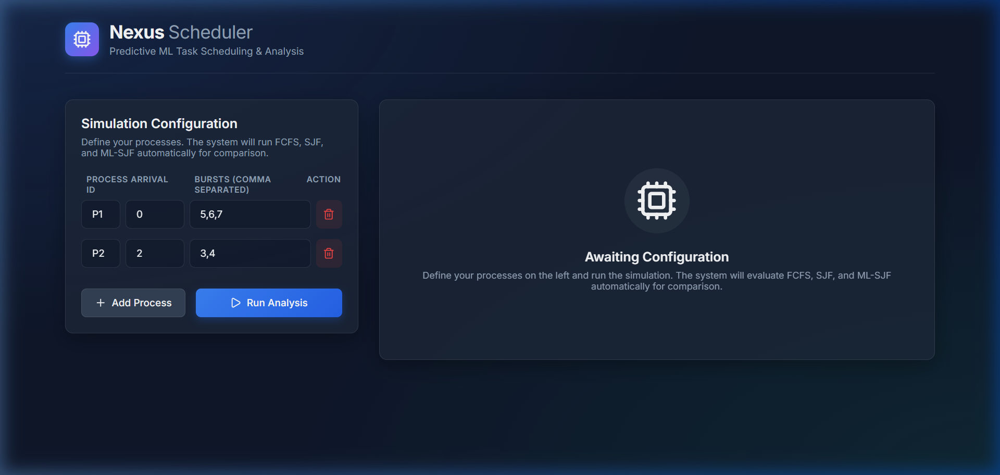
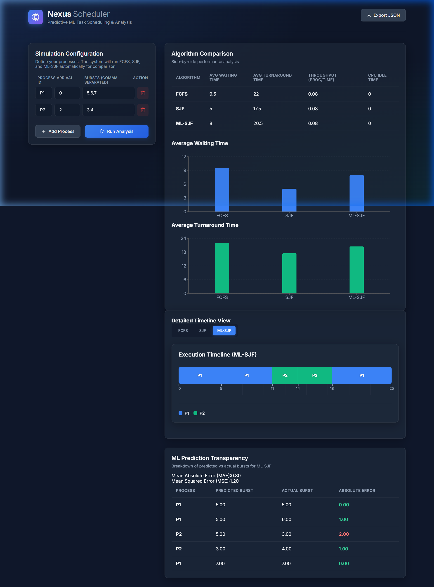

# Nexus Scheduler 🚀
### Predictive ML Task Scheduling & Analysis

Nexus Scheduler is a modern, full-stack CPU scheduling simulator that leverages Machine Learning to predict burst times and optimize task execution. It provides a visual comparison between traditional scheduling algorithms and an ML-enhanced Shortest Job First (ML-SJF) approach.

## ✨ Features
- **Algorithm Comparison**: Side-by-side performance analysis of FCFS, SJF, and ML-SJF.
- **ML Prediction**: Uses a Scikit-learn model to predict the next burst time based on historical data.
- **Interactive Visualization**:
  - **Gantt Charts**: Real-time execution timeline for each algorithm.
  - **Metrics Charts**: Average Waiting Time and Turnaround Time comparisons.
- **Detailed Analytics**: Breakdown of predicted vs. actual burst times with MAE/MSE metrics.
- **Export Data**: Export simulation results as JSON for further analysis.

## 🛠️ Tech Stack
- **Frontend**: React 19, Vite, Recharts, Tailwind CSS.
- **Backend**: FastAPI (Python), Uvicorn.
- **Machine Learning**: Scikit-learn, NumPy, Pandas.

## 🚀 Getting Started

### Prerequisites
- Node.js (v18+)
- Python (v3.9+)

### Installation

1. **Clone the repository**:
   ```bash
   git clone https://github.com/danish975/Cpu-scheduler-using-Machine-Learning-to-predict-next-burst-time.git
   cd Cpu-scheduler-using-Machine-Learning-to-predict-next-burst-time
   ```

2. **Setup Backend**:
   ```bash
   cd backend
   python -m venv venv
   # On Windows:
   .\venv\Scripts\activate
   # On Unix:
   source venv/bin/activate
   pip install -r requirements.txt
   ```

3. **Setup Frontend**:
   ```bash
   cd ../frontend
   npm install
   ```

### Running the Application

1. **Start Backend**:
   ```bash
   cd backend
   uvicorn app.main:app --reload
   ```

2. **Start Frontend**:
   ```bash
   cd frontend
   npm run dev
   ```

## 📊 Visuals

### Dashboard


### Analysis Results


## 📄 License
This project is licensed under the MIT License.
